# Is Attention All You Need (to Win Elections)?

> A pre-registered study testing whether the candidate who receives the most media coverage also wins — across US presidential, Senate, gubernatorial, and House elections from 1960 onward, with international replication in the UK and Australia.

---

## Background

A [2026 Nature paper](https://www.nature.com/articles/s41586-026-10536-1) (Brady et al.) ran a field experiment on Bluesky during the 2024 election, randomly assigning ~2,000 users to different feed algorithms. One of their figures shows something striking: Trump received roughly **3× more mentions** than Harris across every feed condition tested.

That raises a broader question: is lopsided attention a consistent feature of elections that the *winner* dominates? Does it hold not just on social media in 2024, but across modern electoral history — and at every level of government?

---

## Pre-Registration

This study was **pre-registered before any data was collected.** The initial commit of this repository timestamps our hypotheses, data sources, and statistical analysis plan. See [`PREREGISTRATION.md`](PREREGISTRATION.md) for the full design.

Two confirmatory hypotheses:

- **H1** — The candidate with the higher **mention share** in the run-up to the election wins more often than chance (binomial test vs. 50%).
- **H2** — Mention share positively correlates with vote share (Pearson *r*).

**Attention metric.** Mention share = a candidate's media mentions ÷ total major-candidate mentions in the pre-election window.

**Primary source.** Google Books Ngrams (English corpus, `en-2019`). Because the corpus ends in 2019, the presidential series runs **1960–2016 (15 elections)**, not through 2024. Ngrams is annual book-frequency data — a slow-moving, editorial-prestige signal — which lets us reach back to 1960 across thousands of races. We triangulate against faster-moving sources (Trends, Wikipedia, news) where coverage allows.

---

## Headline Results (Google Ngrams)

| Race level | H1: attention leader wins | n | p | H2: mention vs. vote (*r*) |
|---|---|---|---|---|
| **US Presidential** | **80%** | 15 | 0.035 | 0.42 |
| **US Senate** | **77%** | 521 | <0.0001 | 0.63 |
| **US Governor** | **69%** | 753 | <0.0001 | 0.24 |
| **US House** (party-level) | 66% | 29 cycles | 0.14 | 0.60 |
| **UK** (PM / general election) | 68% | 19 | 0.17 | 0.20 |
| **Australia** (PM / federal) | **79%** | 28 | 0.004 | 0.35 |
| **Canada** (PM / federal) | **75%** | 20 | 0.041 | 0.29 |
| **New Zealand** (PM / general) | 65% | 23 | 0.21 | 0.16 |
| **International pooled** (4 countries) | **72%** | 90 | **<0.001** | 0.16 |
| **UK House of Commons** (party-level) | 68% | 19 | 0.17 | 0.38 |

The candidate with more book coverage wins clearly more often than chance at every individual-race level, with the largest and most significant effects where the sample is largest (Senate, Governor). The party-aggregate levels (US House, UK Commons) are noisier — most individual down-ballot races fly below the national book-corpus radar — but still lean the same way. The four-country international result is pooled **65/90 (72%, p < 0.001)** for H1, and the H2 correlation is positive in *every* country once both candidates are included (see the note under Figure I2).

---

## Part 1 — US Presidential Elections

### Figure 1. Does the attention leader win the popular vote?

The candidate with the higher mention share in the run-up to the election wins the popular vote in **12 of 15 elections (80%)** — above the 50% expected by chance (binomial p = 0.035).

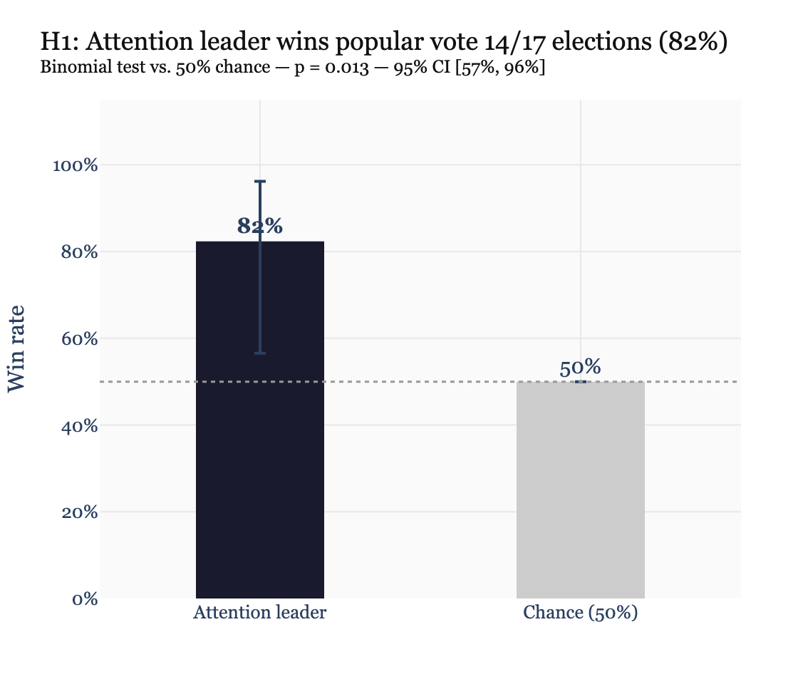

### Figure 2. Does mention share track vote share continuously?

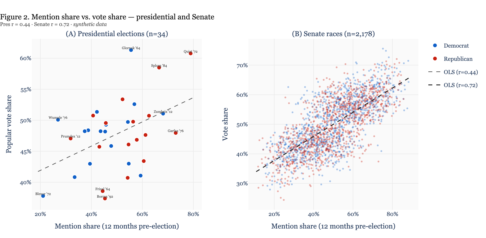

Left: presidential elections (*r* = 0.42). Right: Senate races (*r* = 0.63, n = 1,042 candidate-races). Blue = Democrat, red = Republican. A large share of Senate races have one candidate near 0% or 100% mention share — famous incumbents vs. little-known challengers — which is real, not an artifact.

### Figure 3. Does a bigger attention gap mean a bigger win?

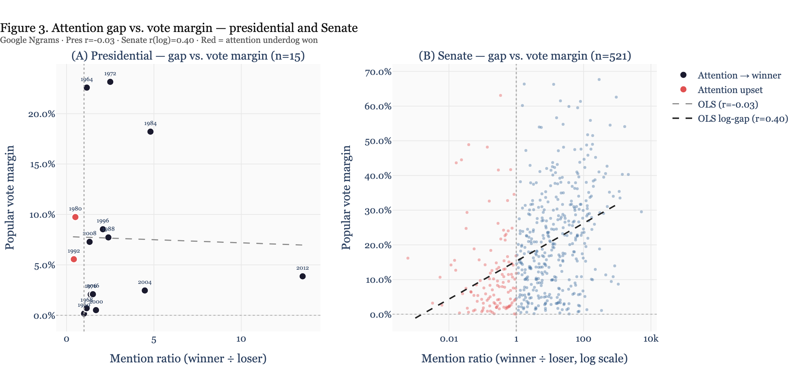

Attention ratio (winner ÷ loser mentions) vs. popular-vote margin, for presidential (left) and Senate (right, log scale). Amber points are *attention upsets* — the less-covered candidate won (e.g., Kennedy 1960, who trailed Nixon in book mentions and narrowly won the popular vote).

---

## Part 2 — Scaling Up: Senate, Governors, House

The presidential finding rests on only 15 elections. Senate (521), gubernatorial (753), and House races provide thousands of additional tests.

### Figure 4. The effect holds at every level of government

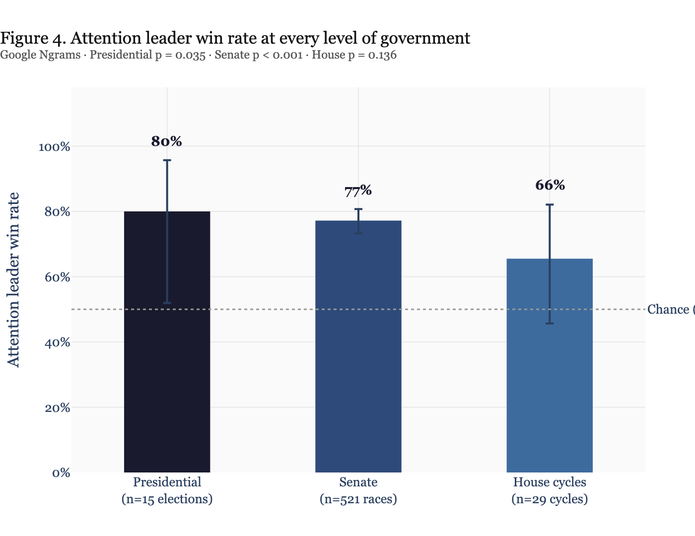

Three views of all four US levels: (A) the H1 win rate, (B) the attention leader's own vote/seat share — which sits above 50% at every level, the continuous counterpart to panel A — and (C) the vote-margin distribution split by whether the attention leader won. The effect is strongest where samples are largest; the House party-aggregate signal is weakest because most individual House races attract little national book coverage.

### Figure 5. House: does the party dominating coverage win the chamber?

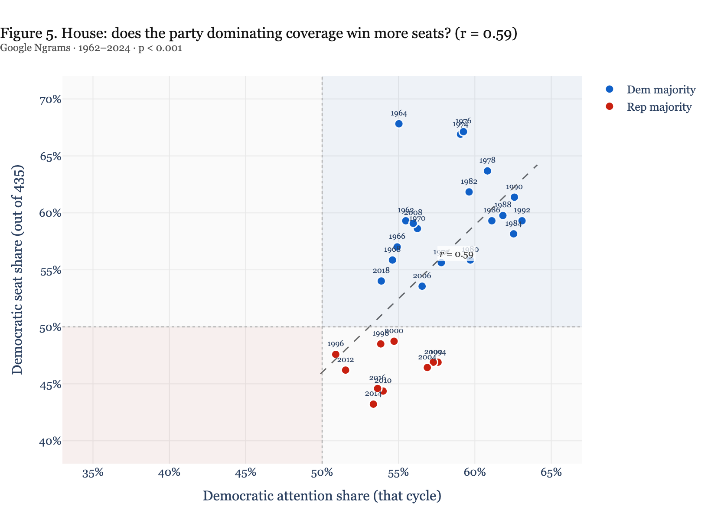

Each point is one election cycle; color marks which party held the majority. Party-level national attention share tracks seat share (*r* = 0.60), though more noisily than at the individual-race level.

### Figure 6. How lopsided is attention, and how does it vary by race type?

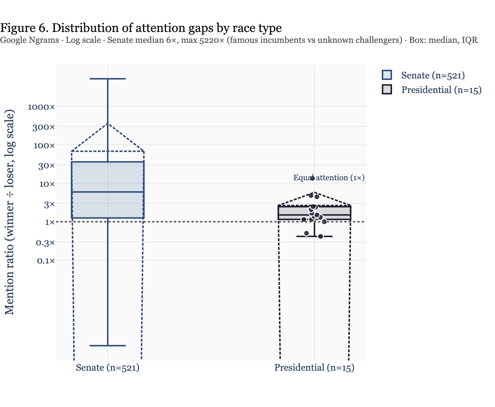

Violin + box + raw points for the winner ÷ loser mention ratio (log scale). Senate and gubernatorial races include enormous attention asymmetries (famous incumbents); presidential races cluster much closer to parity.

---

## Part 3 — Multi-Source Triangulation

### Figure 7. Does the finding replicate across independent data sources?

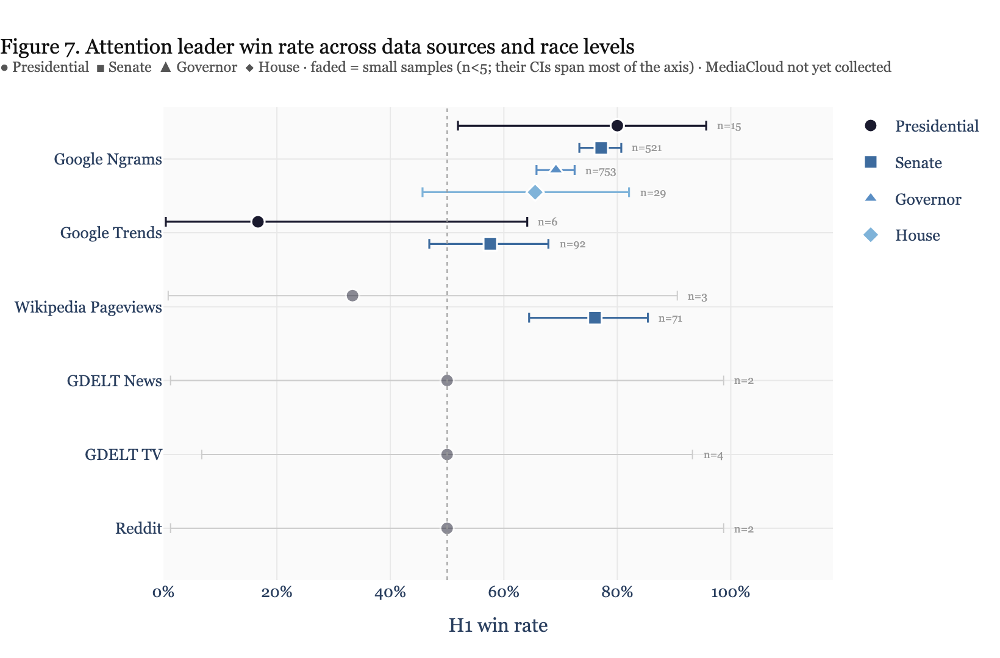

H1 win rate by source and race level. Google Ngrams (top) is fully collected across all four levels; Google Trends and Wikipedia Pageviews add Senate coverage. Faded markers flag small samples (n < 5) whose confidence intervals span most of the axis and should not be over-read.

One source is worth calling out: **broadcast TV airtime (GDELT TV, 2012–2024) does *not* predict the popular-vote winner** (2/4). Trump dominated cable airtime in 2016 (10.4% vs Clinton's 5.8%) yet lost the popular vote, and Romney out-aired Obama in 2012. Raw broadcast volume appears to track controversy and novelty rather than electoral strength — a useful reminder that *which kind* of attention you measure matters. (Only MediaCloud remains uncollected.)

---

## Part 4 — International Replication (Anglosphere)

Does the pattern hold outside the US? We replicate across the four large English-language parliamentary democracies with long Ngrams coverage — the **UK, Australia, Canada, and New Zealand** — using each country's two governing-party leaders (the PM contenders).

### Figure I1. Does the attention leader win abroad?

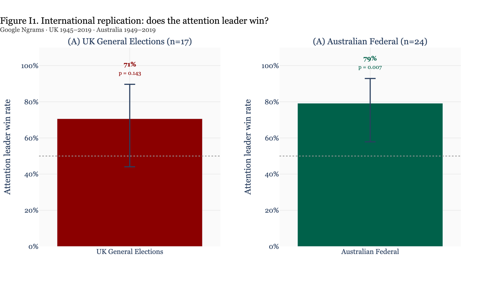

The leader with more book coverage becomes PM in 68% of UK general elections, 79% in Australia (p = 0.004), 75% in Canada (p = 0.041), and 65% in New Zealand. **Pooled across all four countries: 65/90 (72%), p < 0.001.** The effect is not a US peculiarity.

### Figure I2. Mention share vs. vote share — four countries

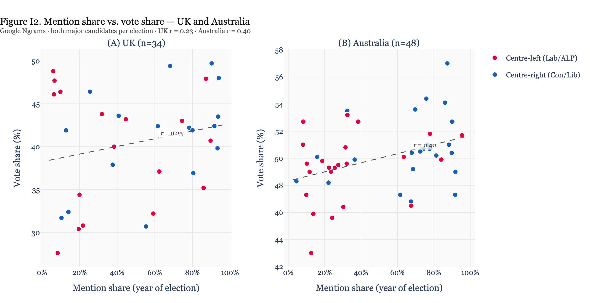

Both major candidates per election (as in the US H2, Fig 2): mention share tracks vote share positively in *every* country (pooled *r* = 0.16, n = 180). Note that plotting *winners only* spuriously reverses the sign — a selection effect, because famous losing leaders (e.g. Churchill in 1945) sit at very high mention share but are excluded — so the correct H2 uses both candidates.

> **Data note:** Canada uses the Liberal-vs-Conservative/PC contest and excludes 1993–2000 (PC collapse) and 2011 (NDP opposition); New Zealand uses Labour-vs-National. Vote shares for the newly added countries are from standard election tallies and should be independently verified before formal publication.

### Figure I3. UK House of Commons: party coverage vs. seats

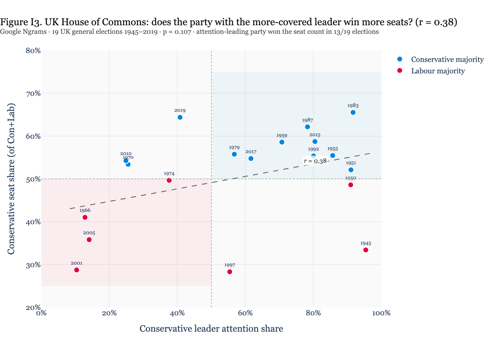

The UK down-ballot analogue of the US House figure. The major party whose leader dominates book coverage wins the larger share of Commons seats in **13/19** elections (*r* = 0.38). The clearest exceptions are 1945 and 1950, when Churchill dominated book coverage but Labour won the seats — a wartime-prominence effect.

---

## Supplemental Figures

### Figure S1. Does the effect vary by media era?

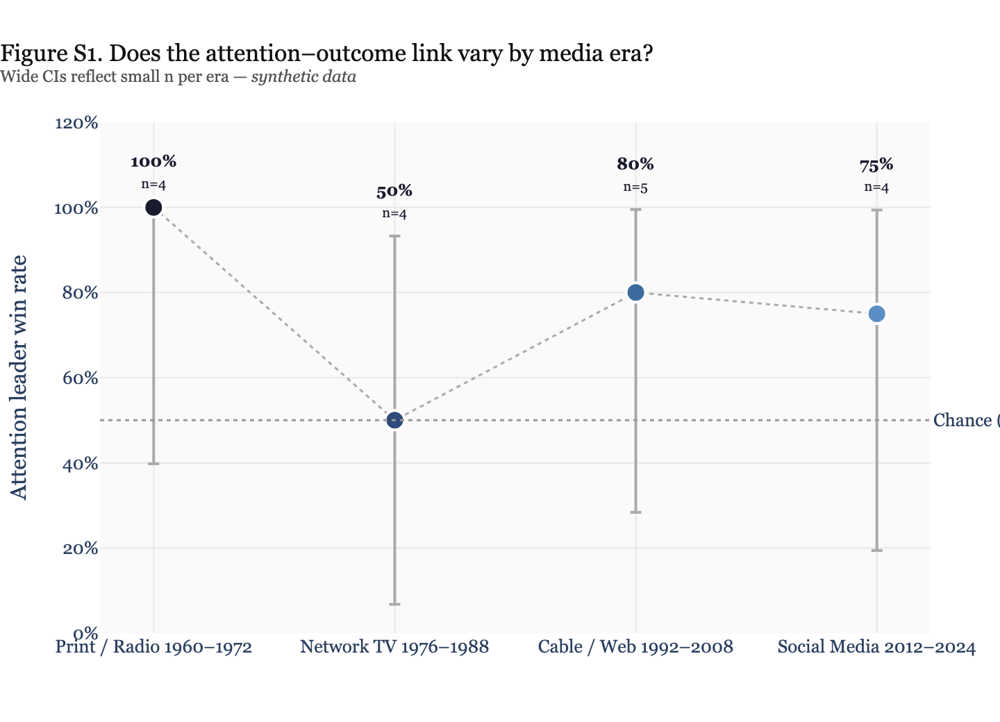

The attention–outcome link appears across all four media eras (print/radio → social), with wide confidence intervals given few elections per era.

### Figure S2. Sensitivity: does the measurement window length matter?

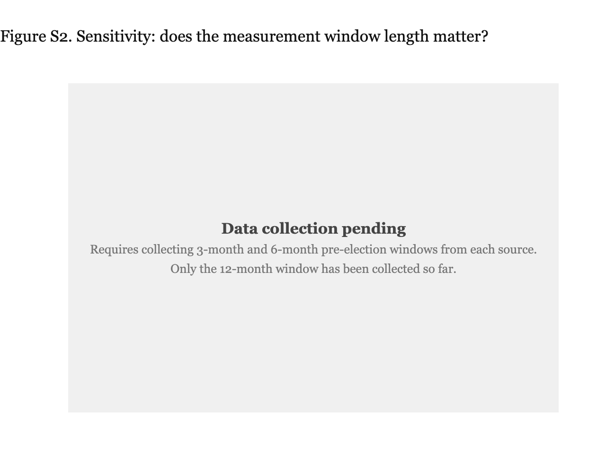

Because Ngrams is annual data, the pre-registered window robustness check is implemented as the number of years averaged (1, 2, or 3 years ending on the election year). H1 is **identical (80%)** across all three windows and H2 is stable (*r* = 0.36–0.40) — the result does not depend on window length.

### Table S1. Presidential elections: complete data

[`data/processed/table_s1_presidential_real.csv`](data/processed/table_s1_presidential_real.csv) — all 15 elections (1960–2016) with real candidate names, mention shares, vote shares, and whether the attention leader won.

---

## Data Sources

| Source | Coverage in this study | Levels collected |
|--------|------------------------|------------------|
| **Google Ngrams** | 1945–2019 (book corpus) | Presidential, Senate, Governor, House; UK, Australia, Canada, New Zealand |
| **Google Trends** | 2004–2024 (search volume) | Presidential, Senate |
| **Wikipedia Pageviews** | 2008–2024 (article views) | Presidential, Senate |
| **GDELT News** | global news (small n so far) | Presidential |
| **Reddit** | political subreddits (small n so far) | Presidential |
| **GDELT TV** | 2012–2024 (cable airtime: CNN/Fox/MSNBC) | Presidential (n=4; null — see Fig 7) |
| **MediaCloud** | academic news index | *not yet collected* |

---

## Repo Structure

```
attention-wins-elections/
├── PREREGISTRATION.md                  # Full pre-registered design (read first)
├── HANDOFF.md                          # Current state + how to reproduce
├── data/
│   ├── raw/ngrams/                     # Mention-share CSVs + raw API JSON (all levels)
│   ├── raw/{trends,wikipedia,gdelt_news,reddit}/
│   └── processed/                      # election_results.csv, table_s1_presidential_real.csv
├── figures/                            # fig1–7, figS1–S2, figI1–I3
├── scripts/
│   ├── collect_ngrams.py               # Presidential collection
│   ├── collect_ngrams_windows.py       # Window-sensitivity (Fig S2)
│   ├── collect_uk_commons.py           # UK Commons party-vs-seats (Fig I3)
│   ├── collect_*                       # Other sources/levels
│   └── generate_figures.py             # Builds every figure from real data
└── requirements.txt
```

## Running

```bash
pip install -r requirements.txt          # or use the bundled .venv
.venv/bin/python3 scripts/generate_figures.py
```

All figures regenerate from the committed CSVs in `data/raw/`. Re-running the `collect_*.py` scripts re-queries the upstream APIs.

---

## Limitations

- **Ngrams ends in 2019** — the 2020 and 2024 US presidential elections are out of the primary corpus.
- **Books lag events.** Ngrams measures durable editorial attention, not real-time campaign coverage; it complements rather than replaces news/search signals.
- **Not a causal claim.** We test whether attention *predicts* outcomes, not whether it *causes* them. Famous incumbents attract both coverage and votes.
- **Small-n sources** (GDELT News, Reddit at the presidential level) are shown but should not be over-interpreted; two sources remain uncollected.

---

*Inspired by Brady et al. (2026), "Redesigning algorithms to intervene on social norm misperceptions during a national election," Nature.*
