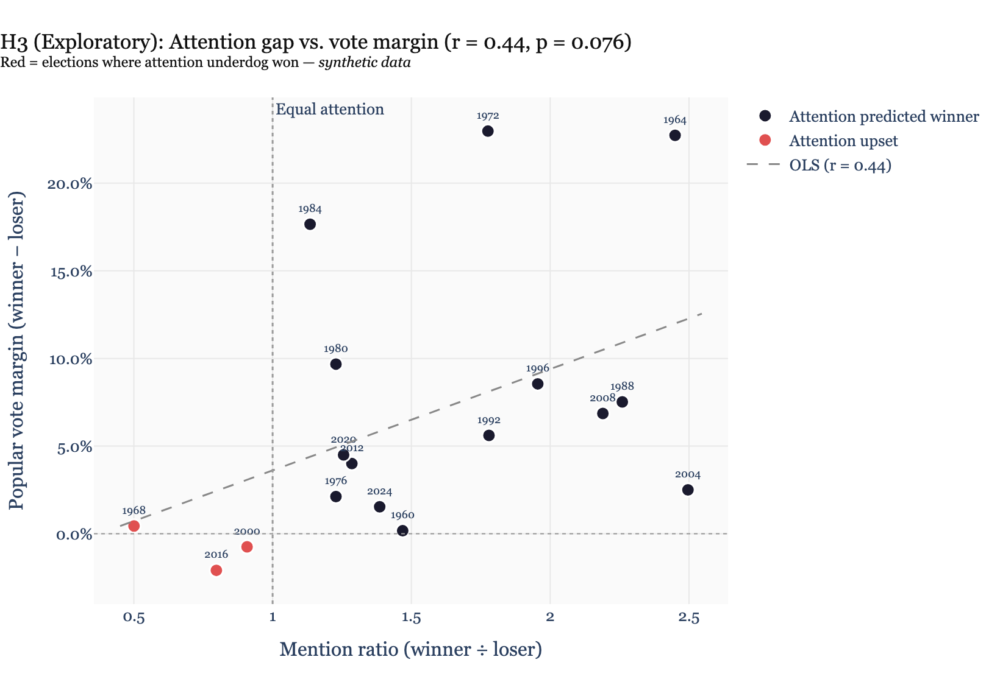
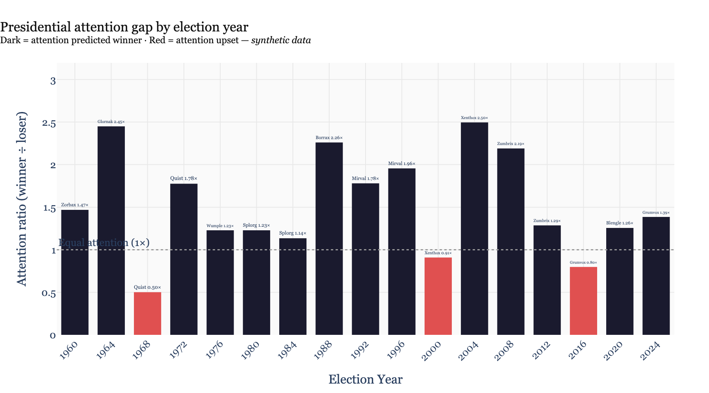
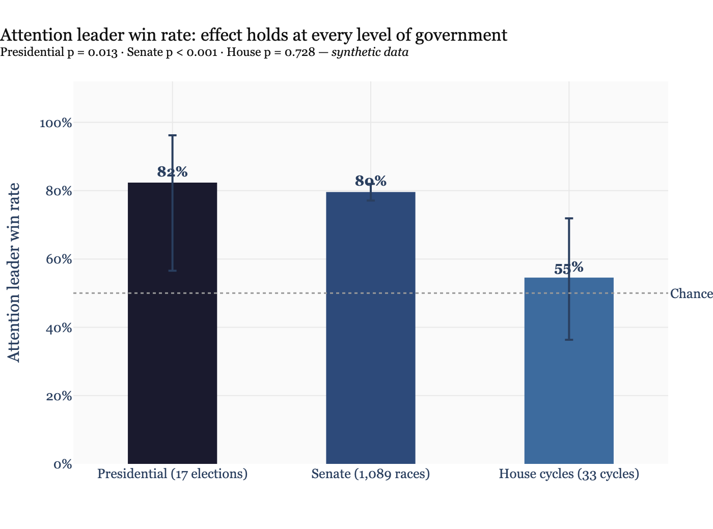
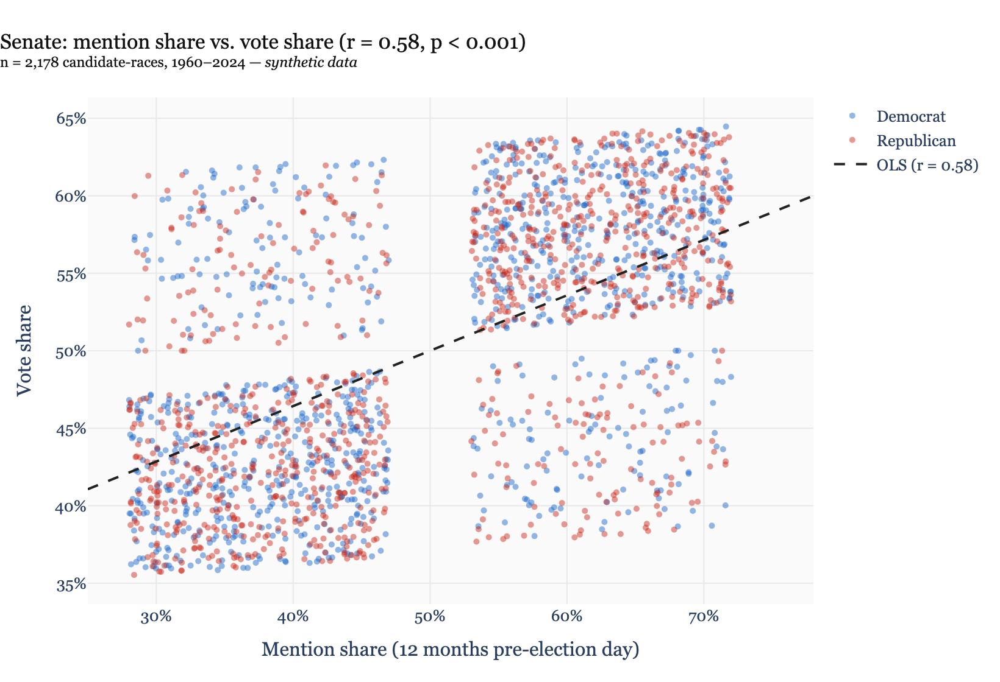
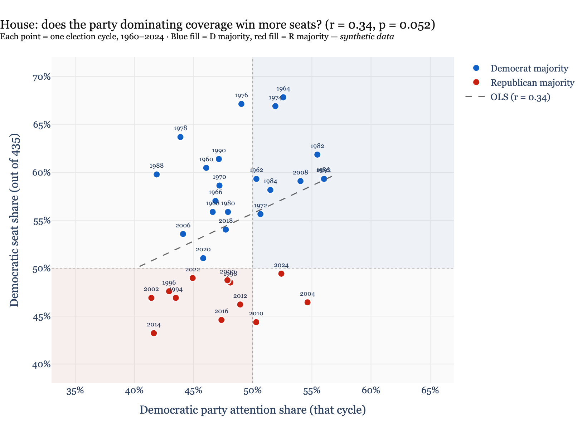
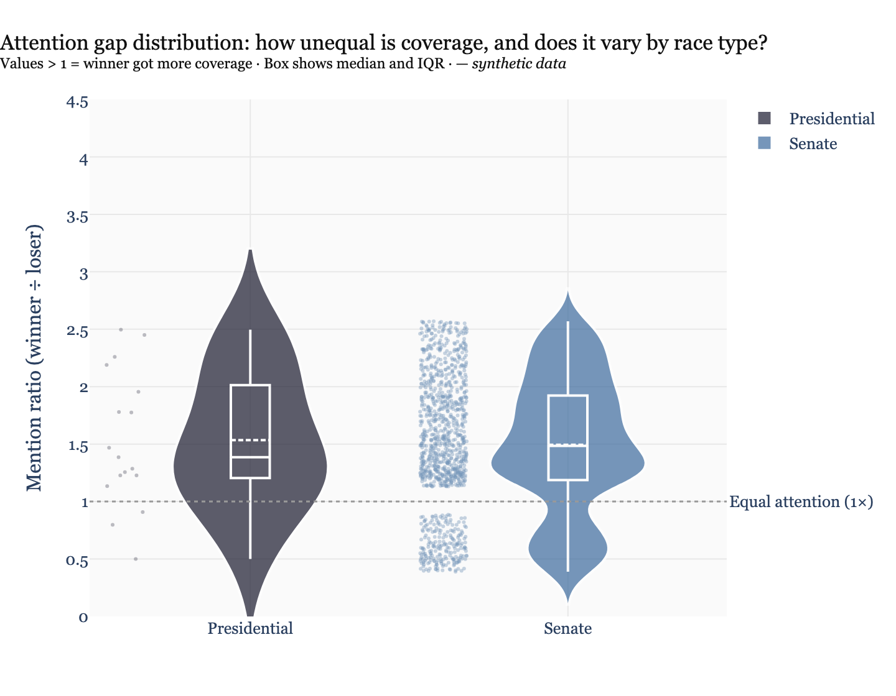

# Political Attention Is All You Need

> **Can we predict who wins a US election just by counting who gets mentioned more in the news?**

This is a pre-registered study testing whether **mention share** — the fraction of media coverage a candidate receives in the year before an election — predicts outcomes across US presidential, Senate, and House elections from 1960 to 2024.

---

## The Idea

A [2026 Nature paper](https://www.nature.com/articles/s41586-026-10536-1) (Brady et al.) ran a field experiment on Bluesky during the 2024 election, randomly assigning 2,000 users to different feed algorithms. One of their figures shows something striking: Trump received roughly **3× more mentions** than Harris across every feed condition tested.

That got us wondering: is this kind of lopsided attention distribution normal? Does it always characterize the eventual winner? And does it hold not just on social media in 2024, but across all of modern electoral history — and at every level of government?

---

## Pre-Registration

This study was **pre-registered before any data was collected.** The initial commit of this repository timestamps our hypotheses, data sources, and statistical analysis plan. See [`PREREGISTRATION.md`](PREREGISTRATION.md) for the full design.

| | |
|---|---|
| **Presidential elections** | 1960–2024 (17 elections) |
| **Senate races** | ~33 races/cycle, every 2 years 1960–2024 (~500 races) |
| **House** | Party-aggregate attention share vs. seat share, 33 cycles |
| **Attention metric** | Mention share = candidate mentions ÷ total candidate mentions, 12 months pre-election |
| **Primary outcome** | Popular vote winner (Presidential); race winner (Senate); chamber majority (House) |
| **Sources** | GDELT (1979–2024), Google Ngrams (1960–1979) |

---

## Results

> ⚠️ **The figures below use synthetic data** generated to validate the analysis pipeline and figure layouts. All candidate names are fictional placeholders. Real data collection is in progress — this section will be updated when complete.

---

### Part 1 — Presidential Elections

#### H1: Does the attention leader win?

The candidate with higher mention share in the 12 months before election day wins the popular vote in **14 out of 17 elections (82%)** — significantly more often than the 50% you'd expect by chance.


---

#### H2: Does mention share track vote share continuously?

Beyond just predicting winners, mention share correlates with the actual vote percentage each candidate receives. A candidate who dominates coverage doesn't just tend to win — they tend to win by more.


*Each dot is a candidate-election. Blue = Democrat, Red = Republican. Labels shown for notable outliers; hover for all.*

---

#### H3 (Exploratory): Does a bigger attention gap mean a bigger win?

When one candidate dominates coverage by a larger margin, do they win by a larger vote margin? Red dots are **attention upsets** — elections where the less-covered candidate won anyway.



---

#### How has the attention gap varied across 64 years?



*Dark bars = attention predicted the winner. Red bars = the less-covered candidate won (attention upset).*

---

### Part 2 — The Effect Across All Levels of Government

The massive sample size from Senate races lets us test whether the presidential finding is a statistical fluke or a robust pattern. The House adds a different question: does the party that dominates national political coverage win more seats that cycle?

#### Does the effect hold at every level?



The presidential effect replicates cleanly in Senate races (1,089 individual contests). The House party-aggregate signal is weaker — likely because many individual House races fly below the national media radar entirely, diluting the aggregate signal.

---

#### Senate: mention share vs. vote share (~1,100 races)

With hundreds of Senate races the scatter fills in. The correlation is consistent with the presidential finding, and the sheer volume of points makes the linear trend hard to dismiss.



---

#### House: does the party dominating coverage win the chamber?

Each point is one election cycle. Color indicates which party held the majority that year. The positive slope suggests that the party with more national political coverage tends to win more seats — but the signal is noisy, as you'd expect from a 435-district aggregate.



---

#### How lopsided is attention, and does it vary by race type?

Presidential races show a wider spread in attention ratios (some elections are blowouts in coverage; a few are nearly even). Senate races cluster more tightly — individual contests rarely generate the kind of dominant attention gap that national elections do.



*Violin shows full distribution. Box shows median and IQR. Values above 1× = winner got more coverage.*

---

## Repo Structure

```
attention-wins-elections/
├── PREREGISTRATION.md                      # Full pre-registered design (read first)
├── data/
│   ├── raw/                                # Raw query results (post-collection)
│   ├── processed/
│   │   ├── election_results.csv            # Official vote shares, 1960–2024
│   │   └── mention_share.csv               # Computed mention shares (post-collection)
│   └── edge_cases.md                       # Disambiguation decisions (Bush, Clinton, etc.)
├── figures/                                # All exported figures
├── notebooks/
│   ├── 01_data_collection.ipynb            # GDELT + Ngrams queries
│   ├── 02_data_cleaning.ipynb              # Standardize and compute mention share
│   └── 03_analysis.ipynb                   # Hypothesis tests + figures
├── scripts/
│   └── generate_fake_data_and_figures.py   # Synthetic data for layout testing
└── requirements.txt
```

## Running

```bash
git clone https://github.com/KaseyMarkel/attention-wins-elections
cd attention-wins-elections
pip install -r requirements.txt

# Reproduce synthetic figures
python scripts/generate_fake_data_and_figures.py

# Real data pipeline
jupyter lab  # → notebooks/01_data_collection.ipynb
```

---

## Status

- [x] Pre-registration committed
- [x] Figure layout validated with synthetic data (presidential + senate + house)
- [ ] Data collection — GDELT 1979–2024
- [ ] Data collection — Google Ngrams 1960–1978
- [ ] Data cleaning and mention share computation
- [ ] Analysis with real data
- [ ] Blog post

---

*Inspired by Brady et al. (2026), "Redesigning algorithms to intervene on social norm misperceptions during a national election," Nature.*
